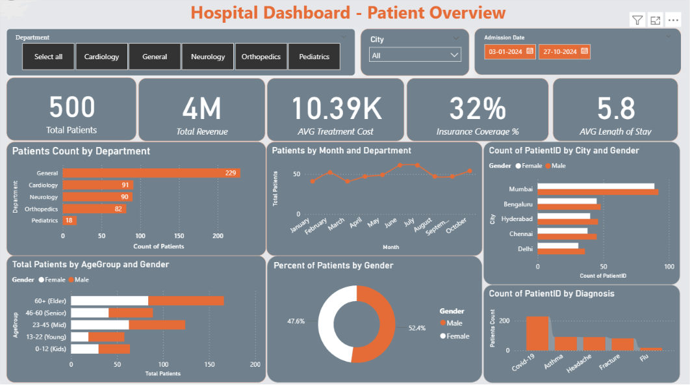
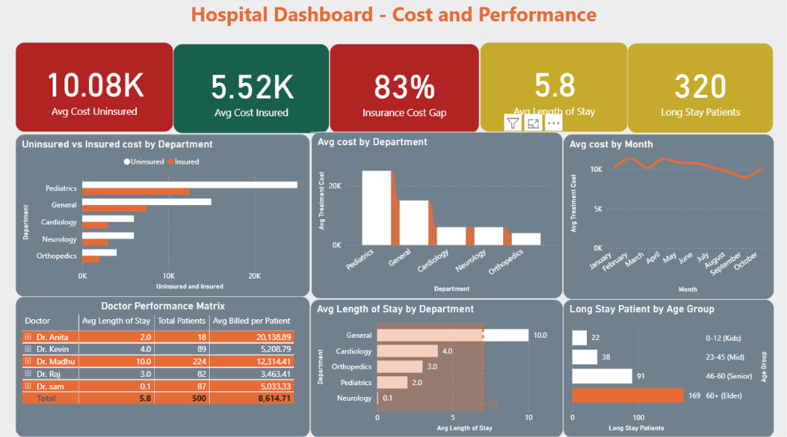

# Healthcare Cost & Patient Outcomes Analysis
**Power BI · Excel Power Query · DAX**  
500 patients · 5 departments · 5 cities 

---

## Business Problem
A multi-city hospital needed visibility into patient cost patterns, departmental performance, and resource allocation. The raw data contained 636 quality issues — duplicate records, negative values, inconsistent categories, and inverted dates — all resolved before analysis.

---

## Dashboard

### Page 1 — Patient Overview


### Page 2 — Cost & Performance


---

## Key Findings & Recommendations

### 💰 Insurance Coverage Gap — Critical Financial Risk
Uninsured patients are billed **82% more** than insured patients (₹10,059 vs ₹5,540). Only 32% of patients carry insurance.

**Recommendation:** Prioritise insurance enrolment drives in Pediatrics — the highest-cost department (₹25,000 avg) with the lowest insurance penetration. This single intervention would have the largest impact on patient financial burden.

---

### 🏥 Pediatrics is a High-Cost, Low-Volume Department
Pediatrics sees only 18 patients (3.6% of total) but costs ₹25,000 avg per visit — **6× more than Orthopedics** (₹4,000) and nearly double General (₹15,000).

**Recommendation:** Review Pediatrics pricing and resource allocation. The cost-to-volume ratio signals either high case complexity or operational inefficiency — both warrant investigation.

---

### ⚕️ Critical Workload Imbalance Among Doctors
Dr. Madhu handles **224 of 500 patients (45%)** with a 10-day average stay. Dr. Anita handles 18 patients at ₹20,138 avg billed — the highest per-patient cost in the hospital.

| Doctor | Patients | Avg Stay | Avg Billed |
|---|---|---|---|
| Dr. Madhu | 224 | 10.0 days | ₹12,314 |
| Dr. Kevin | 89 | 4.0 days | ₹5,209 |
| Dr. Raj | 82 | 3.0 days | ₹3,463 |
| Dr. Sam | 87 | 0.1 days | ₹5,033 |
| Dr. Anita | 18 | 2.0 days | ₹20,139 |

**Recommendation:** Redistribute caseload away from Dr. Madhu. Investigate Dr. Anita's high per-patient billing — either case complexity or billing anomaly.

---

### 👴 Elder Patients are Driving Operational Strain
320 patients (64%) had stays exceeding 4 days. Of those, **169 (53%) are 65+ Elder** and **91 (28%) are 46–60 Senior** patients. The General department has a 10-day average stay — the highest of all departments.

**Recommendation:** Develop dedicated elder care protocols and discharge planning for General and Cardiology departments to reduce long-stay bottlenecks and free up bed capacity.

---

### 🦠 Covid-19 Accounts for Nearly Half of All Cases
224 of 500 patients (44.8%) were treated for Covid-19 — more than all other diagnoses combined. All are routed through the General department, directly explaining its dominance in patient volume.

**Recommendation:** Maintain General department capacity planning around Covid-19 as the primary driver. Consider a dedicated Covid-19 care pathway to separate it from other General cases.

---

## Data & Methodology

**Data Quality Issues Resolved (636 total)**
| Issue | Count | Resolution |
|---|---|---|
| Non-standard Gender values (M/F) | 217 | Replaced → Male/Female |
| Non-standard Insurance values (YES/no) | 185 | Replaced → Yes/No |
| Discharge before Admission date | 109 | Corrected in source |
| Negative Treatment Cost | 110 | Removed |
| Negative Age values | 5 | Removed |
| Duplicate PatientIDs | 10 | Deduplicated |

All cleaning performed in **Excel Power Query** prior to import.

**DAX Measures**
```
Total Patients       = DISTINCTCOUNT(Hospital[PatientID])
Insurance Coverage % = DIVIDE(CALCULATE(COUNTROWS(Hospital), Hospital[Insurance]="Yes"), COUNTROWS(Hospital), 0)
Avg Length of Stay   = AVERAGEX(Hospital, DATEDIFF(Hospital[AdmissionDate], Hospital[DischargeDate], DAY))
Avg Cost Insured     = CALCULATE(AVERAGE(Hospital[Total Amount]), Hospital[Insurance]="Yes")
Avg Cost Uninsured   = CALCULATE(AVERAGE(Hospital[Total Amount]), Hospital[Insurance]="No")
Insurance Cost Gap % = DIVIDE([Avg Cost Uninsured] - [Avg Cost Insured], [Avg Cost Insured], 0)
Long Stay Patients   = COUNTROWS(FILTER(Hospital, DATEDIFF(Hospital[AdmissionDate], Hospital[DischargeDate], DAY) > 4))
```

---

## Repository Structure
```
hospital-dashboard/
├── README.md
├── data/ 
    ├── hospital_sample.csv                    ← Cleaned dataset
    └── hospital_data_issues.csv               ← Raw data quality log     
├── dashboard/
    ├── Healthcare_Analytics_Dashboard.pbix    ← Power BI report
└── screenshots/
    ├── dashboard_overview.png
    └── cost_analysis.png
└── documentation/
    ├── Healthcare_Cost_Patient_Analysis_Report.pdf
└──LICENSE
└──.gitignore
```
